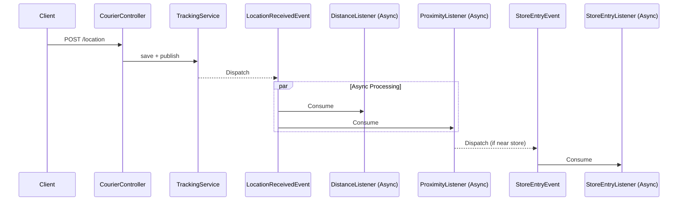

# Courier Tracking System

Real-time courier tracking system that processes streaming GPS locations, calculates total travel distance, and detects store proximity entries using geospatial indexing.

## Tech Stack

- **Java 21** + **Spring Boot 3.5.10**
- **PostgreSQL 18.1**
- **Redis 8.4.0** — Geospatial indexing, caching, re-entry TTL control
- **Docker Compose**

## Architecture


## Design Patterns

### Strategy Pattern
Distance calculation algorithm is configurable via `application.yml`:
- **Haversine**
- **Vincenty**

### Observer Pattern
Spring Events with async listeners.

### Event-Driven Architecture
Lightweight EDA using Spring's `ApplicationEventPublisher`. Services communicate through events, not direct calls.

## API Endpoints

| Method | Endpoint | Description |
|--------|----------|-------------|
| POST | `/api/v1/courier/location` | Send single GPS location |
| POST | `/api/v1/courier/locations/batch` | Send batch GPS locations |
| GET | `/api/v1/courier/{courierId}/distance` | Get total distance (km) |
| GET | `/api/v1/courier/{courierId}/locations` | Get location history |
| GET | `/api/v1/courier/{courierId}/store-entries` | Get store entry logs |
| GET | `/api/v1/store/{storeName}/entries` | Get entry logs by store |

Swagger UI: `http://localhost:8080/swagger-ui/index.html`

## Quick Start

```bash
mvn clean package -DskipTests

docker-compose up --build
```

## Configuration

| Property | Default | Description |
|----------|---------|-------------|
| `app.store.proximity-radius-meters` | 100 | Store proximity detection radius |
| `app.store.reentry-timeout-seconds` | 60 | Re-entry cooldown period |
| `app.calculation.distance-strategy` | haversine | Distance algorithm (haversine/vincenty) |

## Logging

Profile-based logging configuration:

| Profile | Output |
|---------|--------|
| default | Console|
| prod | JSON file|
| staging | Console + JSON|

## Usage Examples & Scripts

### 1. Automated Simulation Script
```
chmod +x simulate.sh

./simulate.sh
```

### 2. Manual API Calls (CURL)


```bash
# Location 1 - Near Ataşehir MMM Migros
curl -X POST http://localhost:8080/api/v1/courier/location \
  -H "Content-Type: application/json" \
  -d '{
    "courierId": "CRR-123",
    "latitude": 40.9923307,
    "longitude": 29.1244229,
    "timestamp": "2024-02-08T14:30:00"
  }'

# Location 2 - Near Novada MMM Migros
curl -X POST http://localhost:8080/api/v1/courier/location \
  -H "Content-Type: application/json" \
  -d '{
    "courierId": "CRR-123",
    "latitude": 40.986106,
    "longitude": 29.1161293,
    "timestamp": "2024-02-08T14:31:00"
  }'

# Location 3 - Back near Ataşehir MMM Migros
curl -X POST http://localhost:8080/api/v1/courier/location \
  -H "Content-Type: application/json" \
  -d '{
    "courierId": "CRR-123",
    "latitude": 40.9924,
    "longitude": 29.1245,
    "timestamp": "2024-02-08T14:32:00"
  }'

# Total Distance
curl http://localhost:8080/api/v1/courier/CRR-123/distance
```